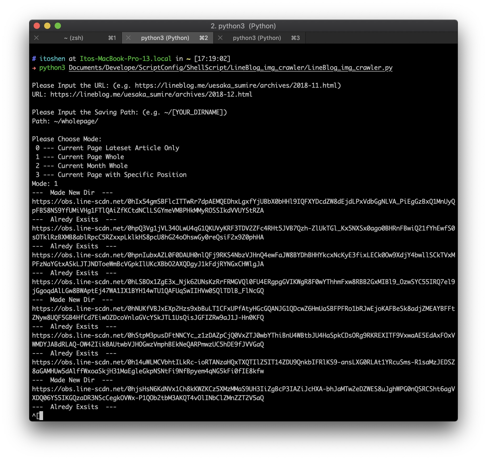

# LINE Blog Image Crawler

## Feature
Crawling LINE Blog Archive's images<br>
**Initial Purpose:** Crawling Uesaka Sumire (上坂すみれ) 's LINE Blog images

## Requirement
- Python3
- bs4 (aka BeautifulSoup 4.x)

### How to Install
#### Python3
- macOS: 
	- Native built-in, no need for downloading
	- Or use `brew install python3` to install the non-native Python3
- Windows: 
	- Checkout here <https://www.python.org/downloads/windows/>
- Linux:
	- Use the package manager
		- e.g. 
			- Debian: `apt install python3`
			- SUSE: `zypper install python3`

#### bs4 (aka BeautifulSoup 4.x)
- macOS:
	- `pip3 install bs4` 
- Windows: 
	- Generally, it's included in Python3's installing package 
	- Or, checkout here <https://pypi.org/project/pip/>
- Linux: 
	
	- Use the package manager: `sudo apt install python3-pip`
	- Or
	
		```
		curl https://bootstrap.pypa.io/get-pip.py -o get-pip.py
		// Download the installing script
		sudo python3 get-pip.py
		// Run the installing script
		```

## Usage
1. `Please Input the URL:`<br> 
	- Please input the web address from which you want to catch images.
		- e.g. https://lineblog.me/uesaka_sumire/archives/2018-12.html
	- Attention: The web address must be an **LINE Blog Archive**, which means the URL will definitely look like: `https://lineblog.me/[PERSON_NAME]/archive/[YEAR]-[MONTH].html`

2. `Please Input the Saving Path:`<br>
	- Please input the path where you want to save the images in the format.
		- e.g. `~/[YOUR_DIRNAME]`

3. Please Choose Mode:<br>
	1. Input `0`: Current Page Lateset Article Only
	2. Input `1`: Current Page Whole
	3. Input `2`: Current Month Whole
	4. Input `3`: Current Page with Specific Position

## Demo

