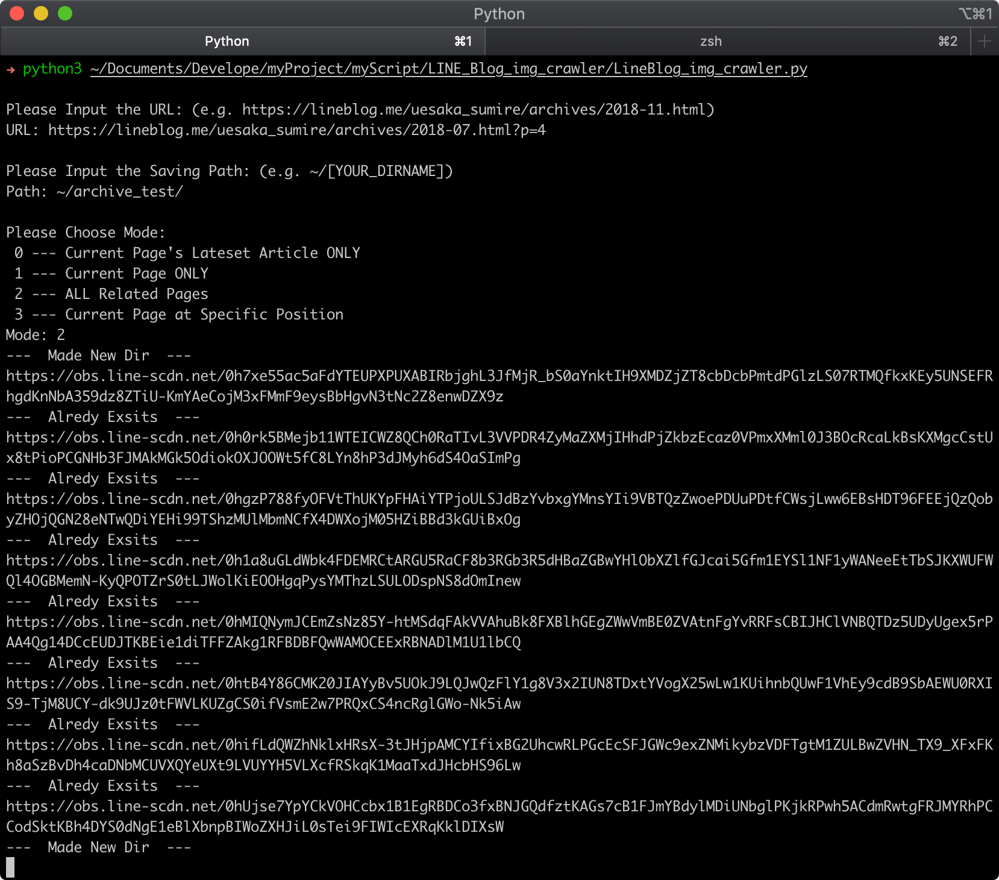

# LINE Blog Image Crawler
> **Initial Purpose:** Crawling Uesaka Sumire (上坂すみれ) 's LINE Blog images

## Feature
- Crawling LINE Blog Archive images **(Archive Image ONLY)**

## Requirement
- Python3
- bs4 (aka *BeautifulSoup 4.x*)

### How to Install
#### Python3
- macOS: 
	- Native built-in, no need for downloading
	- Or use `brew install python3` to install the non-native Python3
- Windows: 
	- Download Python3 manually from <https://www.python.org/downloads/windows/>
- Linux:
	- Use the package manager
		- e.g. 
			- Debian: `apt install python3`
			- SUSE: `zypper install python3`

#### bs4 (aka *BeautifulSoup 4.x*)
- macOS:
	- Run the command `pip3 install bs4` in Teriminal
- Windows: 
	- Generally, it's included in Python3's installing package 
	- Or download `pip` manually from <https://pypi.org/project/pip/>
- Linux: 
	
	- Use the package manager: `sudo apt install python3-pip`
	- Or run the commands below
	
		```
		curl https://bootstrap.pypa.io/get-pip.py -o get-pip.py
		// Download the installing script
		
		sudo python3 get-pip.py
		// Run the installing script
		```

## Usage
1. Open up any terminal app (e.g. macOS - Teriminal.app, Windows - CMD and etc.) and input command `python3 [SCRIPT_PATH]`

2. When `Please Input the URL:` displayed<br> 
	- Please input the web address from which you want to catch images.
		- e.g. https://lineblog.me/uesaka_sumire/archives/2018-12.html
	- **Attention:** The web address must be an **LINE Blog Archive**, which means the URL will definitely look like: `https://lineblog.me/[PERSON_NAME]/archive/[YEAR]-[MONTH].html`

3. When `Please Input the Saving Path:` displayed<br>
	- Please input the path where you want to save the images in the format.
		- e.g. `~/[YOUR_DIRNAME]`
	- If the `path` doesn't exist, it will be made up automatically, or it will just use the exist one.
	- If you choose a `path` where there has already been some earlier image downloads by this script or not, the images will still be downloaded and replaced (if they share the same name).

4. When `Please Choose Mode:` displayed<br>
	- Input `0`: Current Page's Lateset Article Only
		- It will download the first article's images on the current blog page referring to _the URL given_. 
	- Input `1`: Current Page Only
		- It will download all the article images on the current blog page referring to _the URL given_. 
	- Input `2`: All Related Pages
		- It will download all the article images on the related pages which referred to the navigation bar of _the URL given_.
	- Input `3`: Current Page with Specific Position
		- It will download the specific article's images on the current blog page referring to _the URL given_ and _your next input_. 


## Demo



